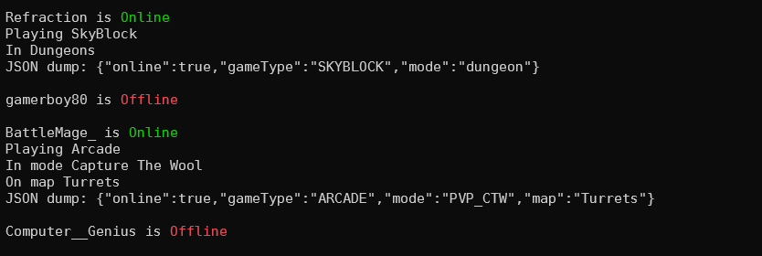

<!-- 
This README was created based on a template found at https://github.com/othneildrew/Best-README-Template
Full credit for this template goes to othneildrew and contributors.
-->

<br />
<p align="center">
  <h1 align="center">Stalkpixel</h3>
  <p align="center">
    A lightweight Node.js application to stalk Hypixel players
    <br />
  </p>
</p>


<!-- TABLE OF CONTENTS -->
## Table of Contents

- [Table of Contents](#table-of-contents)
- [About The Project](#about-the-project)
- [Getting Started](#getting-started)
  - [Prerequisites](#prerequisites)
  - [Installation](#installation)
- [Usage](#usage)
  - [Specify a List of Players](#specify-a-list-of-players)
  - [Specify JSON Files](#specify-json-files)
  - [API Key as Argument](#api-key-as-argument)
- [Acknowledgements](#acknowledgements)


<!-- ABOUT THE PROJECT -->
## About The Project



Stalkpixel is a lightweight Node.js CLI application that can determine whether and where a player is on the Hypixel Network. It utilizes the Mojang and Hypixel public APIs to get this information. Then, it uses data files from the Slothpixel API to parse this data. Stalkpixel can be used to stalk YouTubers, staff members, your friends, or any random player.

<!-- GETTING STARTED -->
## Getting Started

This guide assumes that you have some experience with the terminal. Follow these simple steps to download and install Stalkpixel.

### Prerequisites

To use this application, you must have npm and Node.js installed.

### Installation
 
1. Clone or download the repository
```sh
git clone https://github.com/BattleMage0231/Stalkpixel.git
```
2. Navigate into the main directory
```sh
cd stalkpixel
```
3. Install NPM packages
```sh
npm install
```


<!-- USAGE EXAMPLES -->
## Usage

Before you use the application, you must first edit the apikey property in config/secrets.json to include your API key. You can follow [these instructions](https://github.com/HypixelDev/PublicAPI/blob/master/README.md#obtaining-an-api-key) to get your API key.
```json
{
    "apikey": "<YOUR_KEY_HERE>"
}
```

To run the application, navigate into the main directory and run
```sh
node .
```

By default, the application calls the APIs with all players specified in config/targets.json. To call it with a different list of players, you can change that list or see instructions below.

### Specify a List of Players
```sh
node . --stalk PLAYER1 PLAYER2 PLAYER3 PLAYER4
```

The --stalk flag tells the application to call the APIs with the specified list of players rather than with those found in config/targets.json.

### Specify JSON Files
```sh
node . --json file1.json dir1/file2.json
```

The --json flag tells the application to call the APIs with players found in the specified JSON files. These files must follow the same structure as config/targets.json to be valid.

### API Key as Argument
```sh
node . --key API_KEY
```

The --key flag is an alternative method of providing your API key. It overrides the key found in config/secrets.json.


<!-- ACKNOWLEDGEMENTS -->
## Acknowledgements
* [Mojang API](https://wiki.vg/Mojang_API)
* [Hypixel API](https://github.com/HypixelDev/PublicAPI)
* [Slothpixel Core](https://github.com/slothpixel/core)
* [Slothpixel Constants](https://github.com/slothpixel/hypixelconstants)
* [README Template](https://github.com/othneildrew/Best-README-Template)