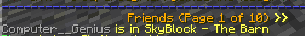
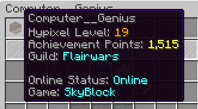
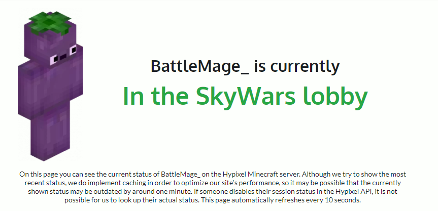
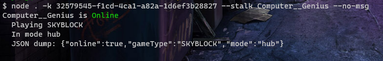

# Alternatives

There are some alternative methods to find the location and online status of a player. However, the author felt that these alternatives often have disadvantages that makes them to be unreliable. Because of this, Stalkpixel was built to efficiently perform this task.

## Friend List

Advantages:
1. Allows you to see the exact location of a player
2. Unaffected by PublicAPI settings
  
Disadvantages:
1. Needs to be friends with everyone you stalk
2. You need to be online

## /profile

Advantages: 
1. Unaffected by PublicAPI settings

Disadvantages:
1. Location shown is not exact
2. You need to be online

## hypixel.paniek.de

Advantages:
1. Very user-friendly and easy to navigate
2. Allows you see the exact location of a player
3. You do not need to be online
   
Disadvantages:
1. The API can be disabled which means that online players may show as offline
2. The website does not update as fast as the API so some results may be delayed or incorrect

## Stalkpixel

Advantages:
1. Allows you see the exact location of a player
2. You do not need to be online
3. You can query many players at once rather than one at a time

Disadvantages:
1. The API can be disabled which means that online players may show as offline
2. You need an API key
